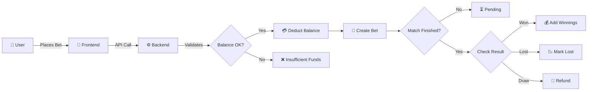

<div align="center">

# ⚽ BetLeague

### Virtual Football Betting Platform for Friend Groups

[](https://opensource.org/licenses/MIT)
[](https://www.typescriptlang.org/)
[](https://reactjs.org/)
[](https://nodejs.org/)
[](https://www.prisma.io/)
[](https://tailwindcss.com/)

**Bet with virtual credits on real football matches. Compete with friends, climb the rankings, and prove you're the smartest bettor in the group.**

[🚀 Deploy](#-deploy-100-grátis) | [📖 Docs](#-api-endpoints) | [🎯 Features](#-features) | [🛠️ Tech Stack](#-tech-stack)

</div>

---

## 📐 Architecture

```
┌─────────────────────────────────────────────────────────────────┐
│                        BETLEAGUE ARCHITECTURE                    │
├─────────────────────────────────────────────────────────────────┤
│                                                                  │
│  ┌─────────────────┐     ┌─────────────────┐                    │
│  │   🖥️ Frontend   │     │   ⚙️ Backend    │                    │
│  │   React + Vite  │────▶│   Express.js    │                    │
│  │   Port 5555     │     │   Port 3001     │                    │
│  └─────────────────┘     └────────┬────────┘                    │
│                                   │                              │
│                    ┌──────────────┼──────────────┐              │
│                    │              │              │              │
│                    ▼              ▼              ▼              │
│           ┌─────────────┐ ┌─────────────┐ ┌─────────────┐      │
│           │  🗄️ SQLite  │ │  🔐 JWT     │ │  📡 Football│      │
│           │  Database   │ │  Auth       │ │  Data API   │      │
│           └─────────────┘ └─────────────┘ └─────────────┘      │
│                                                                  │
└─────────────────────────────────────────────────────────────────┘
```

### 🔄 Data Flow



---

## 🎯 Features

### For Players
| Feature | Description |
|---------|-------------|
| 🎮 **Virtual Betting** | Start with 100 credits, bet on real matches |
| ⚽ **Multiple Markets** | 1X2, Over/Under, BTTS, Correct Score, and more |
| 🎰 **Bet Slips** | Combine multiple selections for higher odds |
| 📊 **Live Dashboard** | Track your bets, balance, and performance |
| 🏆 **Rankings** | Global and group leaderboards |
| 📈 **Statistics** | Win rate, ROI, profit tracking |
| 🔔 **Notifications** | Get notified when bets settle |

### For Groups
| Feature | Description |
|---------|-------------|
| 👥 **Create Groups** | Invite friends with unique codes |
| 🏅 **Group Rankings** | Compete within your friend group |
| 💬 **Social Betting** | See who's winning among friends |

### For Admins
| Feature | Description |
|---------|-------------|
| 📊 **Analytics Dashboard** | Total bets, users, and activity |
| 👤 **User Management** | Block/unblock users, adjust balances |
| ⚙️ **Match Management** | Sync matches, manage odds |

---

## 🛠️ Tech Stack

<table>
<tr>
<td><strong>Frontend</strong></td>
<td><strong>Backend</strong></td>
<td><strong>Database</strong></td>
<td><strong>DevOps</strong></td>
</tr>
<tr>
<td>

- ⚛️ React 18.3
- 📦 Vite 5.2
- 🎨 Tailwind CSS 3.4
- 🗃️ Zustand 4.5
- 🌐 React Router 6
- 📡 Axios 1.7

</td>
<td>

- 🟢 Node.js 20
- 🚂 Express 4.19
- 🔐 JWT + bcrypt
- 📝 Zod Validation
- 📚 Swagger/OpenAPI
- 🛡️ Helmet + CORS

</td>
<td>

- 🗄️ PostgreSQL (Prod)
- 💾 SQLite (Dev)
- 🔧 Prisma ORM 5.14
- 🔍 Full-text Search

</td>
<td>

- 🐳 Docker Compose
- ⚡ Turborepo
- 🧪 Vitest
- 📝 ESLint + Prettier
- 🚀 Vercel (Deploy)

</td>
</tr>
</table>

---

## 🚀 Deploy (100% Grátis)

Deploy completo usando **Vercel** + **Supabase** — sem cartão de crédito, sem spin-down.

### Arquitetura de Deploy

```
┌──────────────────┐     ┌──────────────────┐     ┌──────────────┐
│     🌐 Vercel    │     │   🗄️ Supabase    │     │ cron-job.org │
│   (Frontend +    │────▶│   (PostgreSQL)   │     │   (Triggers) │
│    API Server)   │     │                  │     │              │
└──────────────────┘     └──────────────────┘     └──────┬───────┘
                                                         │
                              ┌──────────────────────────┘
                              │ Ping a cada 30min/2min
                              ▼
                       ┌──────────────┐
                       │ /api/cron/*  │
                       └──────────────┘
```

### Setup Rápido

#### 1️⃣ Criar Supabase (PostgreSQL grátis)
1. Vai a [supabase.com](https://supabase.com) → Login com GitHub
2. **New Project** → Nome: `betleague`
3. Vai a **Settings → Database → Connection string → URI**
4. Copia a URI

#### 2️⃣ Criar Vercel (Hosting grátis)
1. Vai a [vercel.com](https://vercel.com) → Login com GitHub
2. **Add New → Project** → Seleciona `fernando053/betleague`
3. Adiciona Environment Variables:

| Variable | Value |
|----------|-------|
| `DATABASE_URL` | URI do Supabase |
| `JWT_SECRET` | String longa aleatória |
| `CRON_SECRET` | String longa aleatória |
| `FRONTEND_URL` | `https://betleague.vercel.app` |
| `PORT` | `3001` |
| `NODE_ENV` | `production` |

4. **Deploy**

#### 3️⃣ Criar tabelas no Supabase
Vai ao SQL Editor do Supabase e executa o schema do Prisma:

```bash
# Localmente, após configurar o .env com a URI do Supabase:
npx prisma db push
npx prisma db seed
```

#### 4️⃣ Configurar Cron Externo
1. Vai a [cron-job.org](https://cron-job.org) → Login
2. Cria 2 jobs:

| Job | URL | Schedule |
|-----|-----|----------|
| Sync Matches | `https://betleague.vercel.app/api/cron/sync` | `*/30 * * * *` |
| Settle Bets | `https://betleague.vercel.app/api/cron/settle` | `*/2 * * * *` |

Headers: `Authorization: Bearer [O_TEU_CRON_SECRET]`

📖 **Guia completo:** Ver [DEPLOY.md](DEPLOY.md)

---

## ⚡ Quick Start (Local)

### Pré-requisitos
- Node.js 20+
- Docker (opcional, para PostgreSQL)

### 🐳 Docker (Recomendado)

```bash
# Iniciar PostgreSQL + API + Web
docker-compose up -d

# Criar tabelas
npx prisma db push

# Popular dados de teste
npx prisma db seed
```

### 🔧 Manual

```bash
# Instalar dependências
npm install

# Configurar base de dados
cd apps/api
cp .env.example .env
# Editar .env com a tua DATABASE_URL

# Criar tabelas e popular dados
npx prisma db push
npx tsx prisma/seed.ts

# Iniciar desenvolvimento
cd ../..
npm run dev
```

### 📱 Acesso

| Serviço | URL |
|---------|-----|
| 🌐 Frontend | http://localhost:5555 |
| ⚙️ API | http://localhost:3001 |
| 📚 Swagger Docs | http://localhost:3001/api/docs |
| 🩺 Health Check | http://localhost:3001/api/health |

### 🔑 Credenciais de Teste

| Role | Email | Password |
|------|-------|----------|
| 👑 Admin | admin@betleague.com | admin123 |
| 👤 User | joao@example.com | password123 |
| 👤 User | maria@example.com | password123 |
| 👤 User | pedro@example.com | password123 |

**Código de convite do grupo:** `TESTCODE`

---

## 📁 Project Structure

```
betleague/
├── 📂 apps/
│   ├── 📂 api/                    # Express Backend
│   │   ├── 📂 prisma/
│   │   │   ├── schema.prisma      # Database schema
│   │   │   └── seed.ts            # Test data seeder
│   │   ├── 📂 src/
│   │   │   ├── 📂 config/         # Env, Swagger config
│   │   │   ├── 📂 jobs/           # Cron jobs (sync, settle)
│   │   │   ├── 📂 middleware/     # Auth, Validation
│   │   │   ├── 📂 routes/         # API routes
│   │   │   ├── 📂 services/       # Business logic
│   │   │   ├── 📂 lib/            # Prisma client
│   │   │   └── index.ts           # Entry point
│   │   ├── 📂 tests/              # API tests
│   │   ├── Dockerfile
│   │   └── package.json
│   │
│   └── 📂 web/                    # React Frontend
│       ├── 📂 src/
│       │   ├── 📂 components/     # Reusable UI
│       │   ├── 📂 pages/          # Route pages
│       │   ├── 📂 hooks/          # Custom hooks
│       │   ├── 📂 lib/            # API client, Auth
│       │   ├── 📂 store/          # Zustand stores
│       │   └── main.tsx           # Entry point
│       ├── 📂 public/             # Static assets
│       ├── 📂 tests/              # Frontend tests
│       ├── Dockerfile
│       └── package.json
│
├── 📄 vercel.json                  # Vercel config
├── 📄 docker-compose.yml           # Docker config
├── 📄 turbo.json                   # Monorepo config
├── 📄 .eslintrc.json               # Linting
├── 📄 .prettierrc                  # Formatting
└── 📄 package.json                 # Root package.json
```

---

## 📡 API Endpoints

<details>
<summary><strong>🔐 Authentication</strong></summary>

| Method | Endpoint | Description |
|--------|----------|-------------|
| POST | `/api/auth/register` | Register new user |
| POST | `/api/auth/login` | Login |

</details>

<details>
<summary><strong>👤 Users</strong></summary>

| Method | Endpoint | Description |
|--------|----------|-------------|
| GET | `/api/users/me` | Get profile |
| PATCH | `/api/users/me` | Update profile |
| POST | `/api/users/change-password` | Change password |

</details>

<details>
<summary><strong>👥 Groups</strong></summary>

| Method | Endpoint | Description |
|--------|----------|-------------|
| POST | `/api/groups` | Create group |
| POST | `/api/groups/join` | Join by invite code |
| GET | `/api/groups` | List user's groups |
| GET | `/api/groups/:id` | Group details |
| POST | `/api/groups/:id/leave` | Leave group |

</details>

<details>
<summary><strong>⚽ Matches</strong></summary>

| Method | Endpoint | Description |
|--------|----------|-------------|
| GET | `/api/matches` | Upcoming matches (paginated) |
| GET | `/api/matches/live` | Live/started matches |
| GET | `/api/matches/:id` | Match details + odds |

</details>

<details>
<summary><strong>🎰 Bets</strong></summary>

| Method | Endpoint | Description |
|--------|----------|-------------|
| POST | `/api/bets` | Place bet |
| GET | `/api/bets` | List bets (paginated) |
| GET | `/api/bets/active` | Active/pending bets |
| GET | `/api/bets/history` | Settled bets |
| POST | `/api/bets/:id/cancel` | Cancel pending bet |

</details>

<details>
<summary><strong>🏆 Rankings</strong></summary>

| Method | Endpoint | Description |
|--------|----------|-------------|
| GET | `/api/rankings/global` | Global leaderboard |
| GET | `/api/rankings/group/:id` | Group leaderboard |

</details>

<details>
<summary><strong>🔔 Notifications</strong></summary>

| Method | Endpoint | Description |
|--------|----------|-------------|
| GET | `/api/notifications` | List notifications |
| PATCH | `/api/notifications/:id/read` | Mark as read |
| POST | `/api/notifications/read-all` | Mark all as read |

</details>

<details>
<summary><strong>👑 Admin</strong></summary>

| Method | Endpoint | Description |
|--------|----------|-------------|
| GET | `/api/admin/stats` | Dashboard statistics |
| GET | `/api/admin/users` | List all users |
| PATCH | `/api/admin/users/:id` | Update user |
| POST | `/api/admin/users/:id/block` | Block/unblock user |
| GET | `/api/admin/groups` | List all groups |
| POST | `/api/admin/sync-matches` | Force match sync |
| POST | `/api/admin/scrape-odds` | Apply scraped odds |

</details>

<details>
<summary><strong>🔄 Cron Endpoints</strong></summary>

| Method | Endpoint | Description |
|--------|----------|-------------|
| GET | `/api/cron/sync` | Sync matches (protected) |
| GET | `/api/cron/settle` | Settle bets (protected) |
| GET | `/api/health` | Health check |

</details>

---

## ⚙️ Environment Variables

| Variable | Required | Description | Default |
|----------|----------|-------------|---------|
| `DATABASE_URL` | ✅ | PostgreSQL connection string | - |
| `JWT_SECRET` | ✅ | JWT signing secret | - |
| `JWT_EXPIRES_IN` | ❌ | Token expiration | `7d` |
| `PORT` | ❌ | Server port | `3001` |
| `FOOTBALL_DATA_API_KEY` | ❌ | Football-Data.org API key | - |
| `FRONTEND_URL` | ❌ | CORS allowed origin | `http://localhost:5173` |
| `CRON_SECRET` | ❌ | Secret for cron endpoints | - |

---

## 🧪 Testing

```bash
# Run all tests
npm test

# Run API tests only
npm run test:api

# Run Web tests only
npm run test:web

# Run tests in watch mode
cd apps/api && npx vitest
```

### Test Coverage

| Suite | Tests | Description |
|-------|-------|-------------|
| `schemas.test.ts` | 5 | Zod schema validation |
| `bet-logic.test.ts` | 11 | Bet settlement logic |
| `env.test.ts` | 11 | Environment config |
| `localStorage.test.ts` | 2 | localStorage mock |
| `hooks.test.ts` | 1 | Hook exports |

---

## 📄 License

MIT License - see [LICENSE](LICENSE) for details.

---

<div align="center">

**Made with ⚽ for football friends**

[⬆ Back to Top](#-betleague)

</div>
